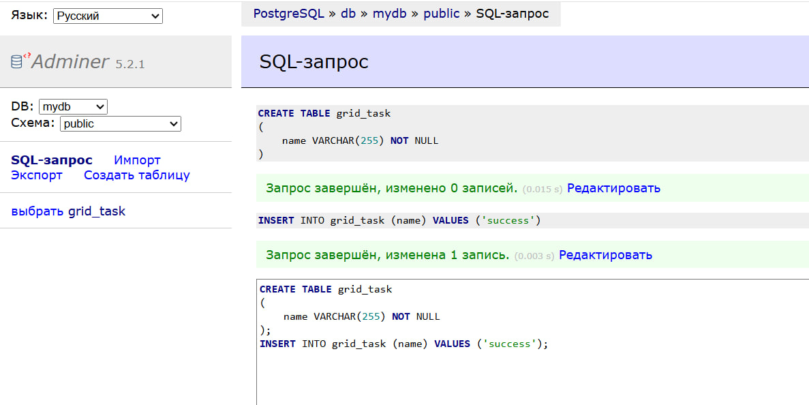
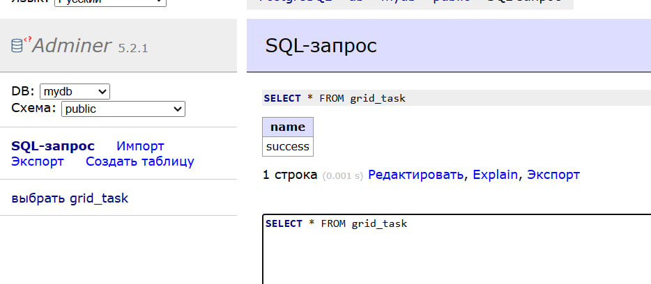
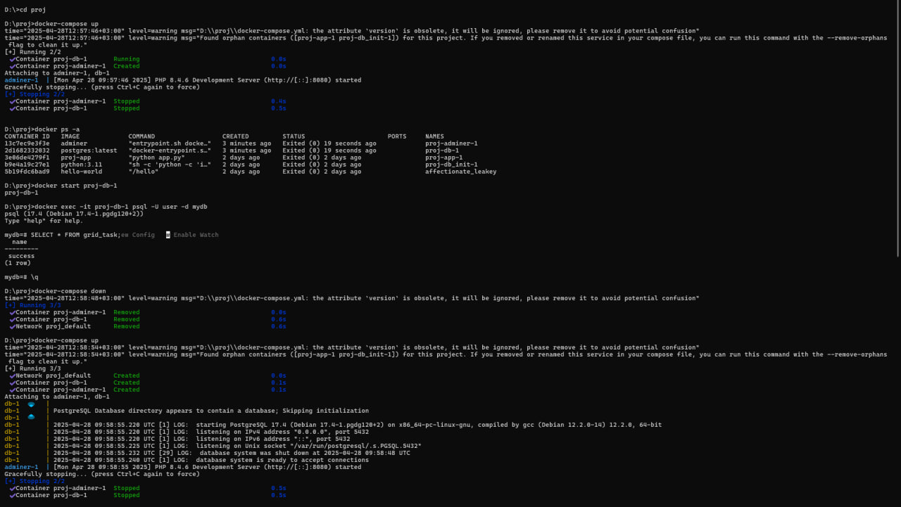
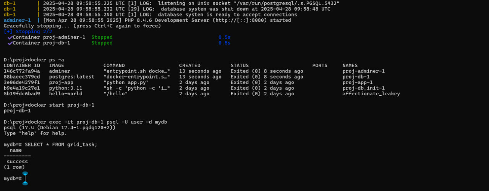

# Task 1. Basics of containerization


## Setup and Start
1. **Clone the repository:**
   ```bash
   git clone https://github.com/nastya-fed/grid_task1.git
   ```

2. **Go to the project folder:**
   ```bash
   cd <repo_folder>
   ```

3. **Start the containers:**
   ```bash
   docker-compose up
   ```

4. **UI will be available at:**
   [http://localhost:8080](http://localhost:8080)

5. **Login to the UI Adminer:** 
    Enter the user name, password, and database name in the file .yml. In this case, it's user, pass, mydb.

6. **Create a new table and add a row to it**
    

7. **Stop the docker-compose:**
   ```bash
   docker-compose down
   ```

5. **Rebuild and start the containers:**
   ```bash
   docker-compose up
   ```

6. **Login to the UI Adminer**  
7. **Using an SQL query, check that the data has been saved**
    

## Using Command Line for Database Interaction

To interact with your PostgreSQL database directly from the command line:

1. **Check the status of your containers:**
   ```bash
   docker ps -a
   ```

2. **Start the containers:**
   ```bash
   docker start proj-db-1
   ```

3. **Connect to the PostgreSQL container:**
   ```bash
   docker exec -it proj-db-1 psql -U user -d mydb
   ```

4. **Show the contents of the `grid_task`:**
   ```sql
   SELECT * FROM grid_task;
   ```
    Result:
    ```bash
    mydb=# SELECT * FROM grid_task;
    name
    ---------
    success
    (1 row)
    ```
5. **Restarting the Containers**

    ```bash
    docker-compose down && docker-compose up
    ```
6. **Let's repeat steps 2-4 and see that the data does not disappear after the restart.**
    
    

